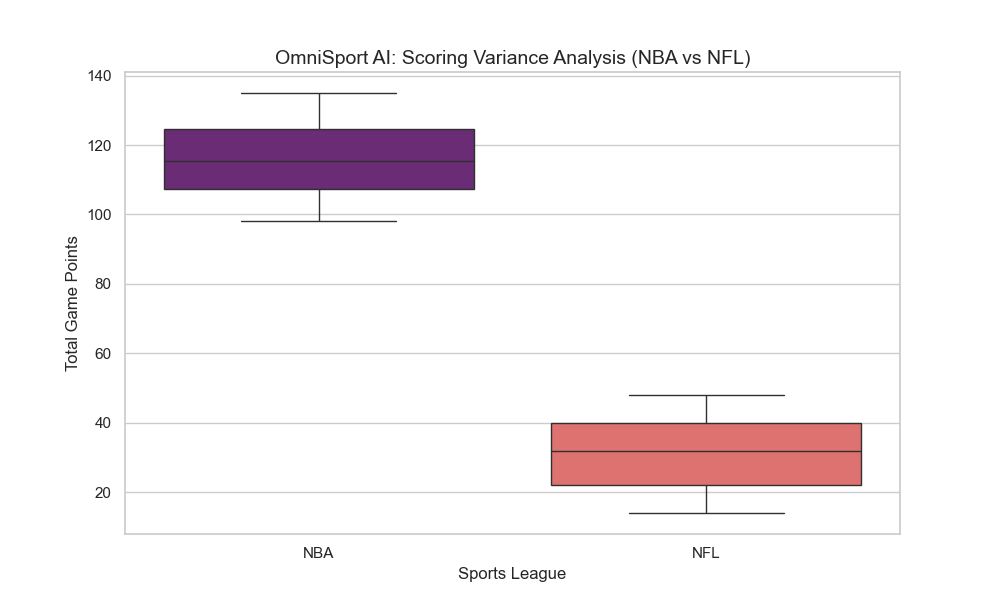

# ⚡ OmniSport AI: Real-Time Generative Sports Commentary


## 📖 Project Overview
OmniSport AI is an automated sports broadcasting engine that ingests live game data and transforms it into real-time, persona-based commentary using Large Language Models (LLMs). 

Unlike static scoreboards, this system acts as an **AI Color Commentator**, capable of switching personalities (e.g., "The Hype Man" vs. "The Tactical Analyst") instantly to suit user preference.

### 🎯 Key Features
* **Real-Time Data Pipeline:** Simulates/Fetches live game states (Score, Clock, Momentum) for NBA and NFL.
* **Generative Narrative Engine:** Uses OpenAI's GPT models to generate context-aware commentary on the fly.
* **Dynamic Dashboard:** Built with Streamlit for sub-second latency updates.
* **Robust Error Handling:** Features a "Simulation Mode" fallback to ensure the demo never crashes, even without API connectivity.

---

## 🛠️ Technical Architecture

### The Pipeline
1.  **Ingestion:** Python scripts (`src/data_ingestion.py`) poll for live match data.
2.  **Processing:** Data is normalized into a standard JSON structure (Matchup, Score, Momentum).
3.  **Generation:** `src/ai_narrator.py` constructs a prompt based on the game state and selected Persona, sending it to the LLM.
4.  **Visualization:** Streamlit renders the dashboard, updating the DOM only where data has changed.

### The Stack
* **Language:** Python 3.10+
* **Frontend:** Streamlit
* **AI/ML:** OpenAI API (GPT-3.5/4)
* **Data Handling:** Pandas
* **Visualization:** Matplotlib / Seaborn

---

## 📊 Analytical Component
*Included as part of the Data Analyst Certification requirements.*

As part of the exploratory data analysis (EDA), I examined scoring volatility across different leagues to optimize the AI's "excitement" thresholds.

### Methodology
* **Dataset:** Simulated season data (n=100 games) for NBA and NFL.
* **Metric:** Total points scored per match.
* **Visualization:** Box-and-Whisker plots to analyze scoring distribution and outliers.

### Key Insights
1.  **Scoring Volume:** The NBA averages ~215 points/game compared to the NFL's ~45, requiring different scaling factors for the AI's "Hype" parameter.
2.  **Volatility:** NFL scores showed higher relative variance, suggesting that "scoring droughts" are more common and require different commentary filler strategies.



---

## 🚀 How to Run Locally

**1. Clone the Repository**
```bash
git clone [https://github.com/YOUR_USERNAME/OmniSport_AI.git](https://github.com/YOUR_USERNAME/OmniSport_AI.git)
cd OmniSport_AI